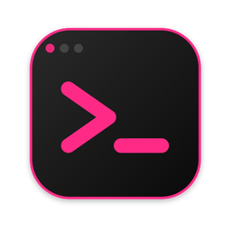
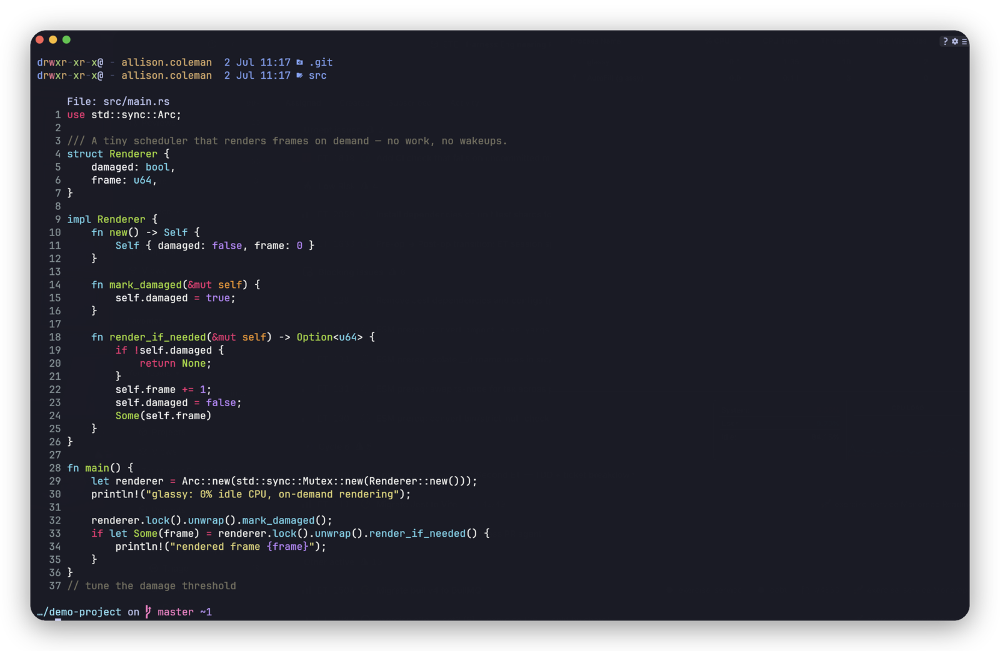
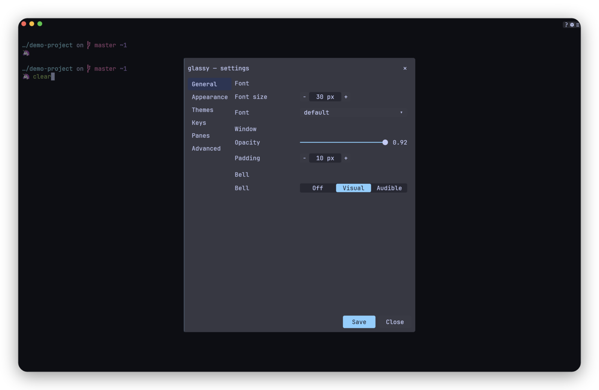
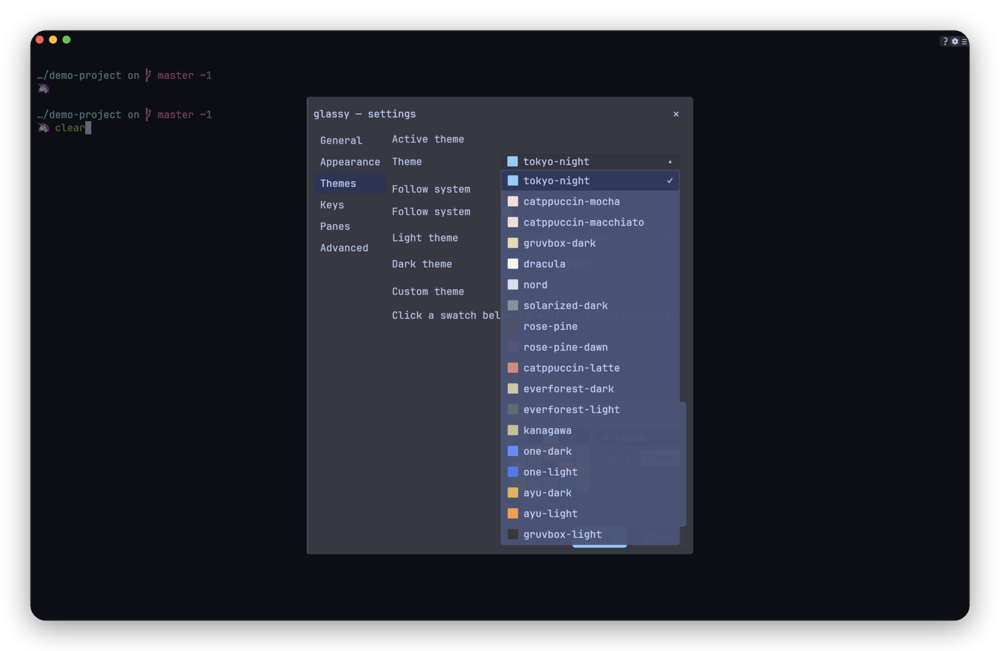
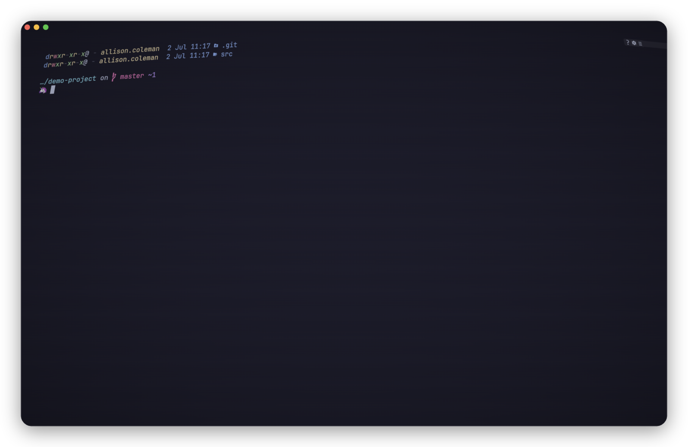
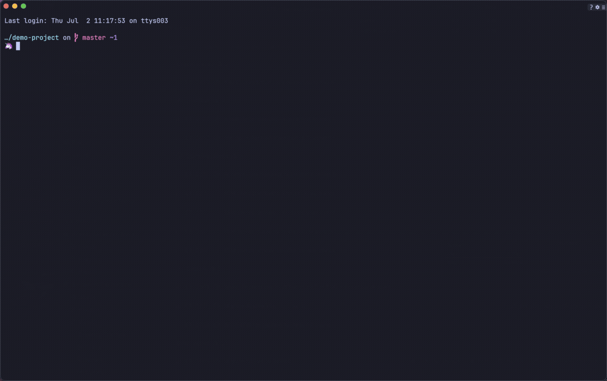
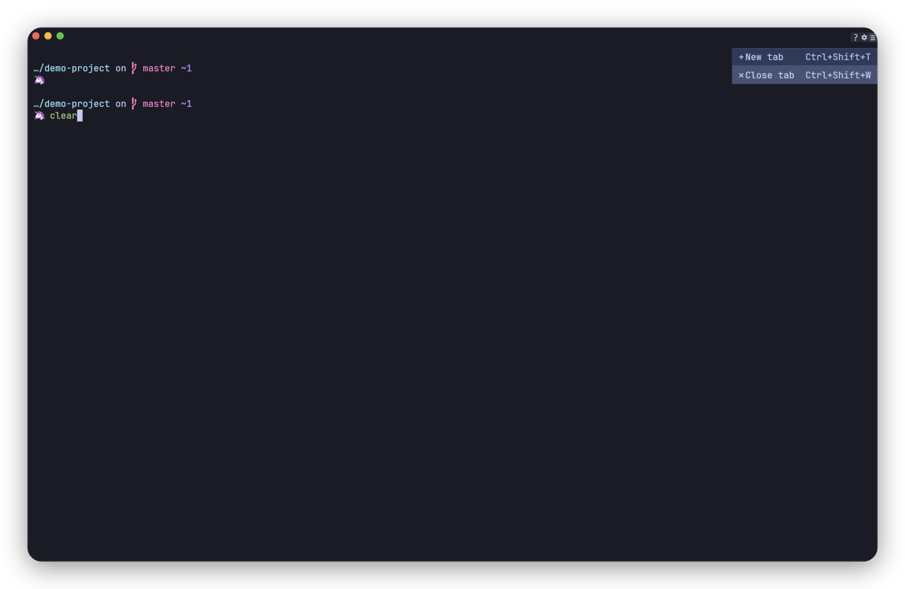

<div align="center">



# glassy

**A minimal, blazing-fast, GPU-accelerated terminal emulator in Rust.**

[](https://github.com/alliecatowo/glassy/actions/workflows/ci.yml)
[](https://github.com/alliecatowo/glassy/releases)
[](LICENSE)
[](https://www.rust-lang.org)
[](https://github.com/alliecatowo/glassy)
[](#install)

<br/>



</div>

---

## Why glassy

glassy is small and quiet on purpose. It does the work the GPU is good at, and nothing else.

- **Tiny footprint.** The stripped release binary is **~10 MB** — compare ~123 MB for ghostty. Fat LTO, a single codegen unit, and `panic = "abort"` keep it lean.
- **0% idle CPU.** Rendering is **on-demand**: with nothing changing on screen, glassy issues no frames and burns no cycles. No background spin, no wakeups.
- **Damage-based redraw.** When the screen *does* change, only the cells that actually changed are re-rasterized and re-uploaded — not the whole grid.
- **Low input latency.** The swapchain uses **Mailbox** present mode with **`max_frames_in_flight = 1`**, so a keystroke reaches the glass on the very next frame instead of queueing behind buffered ones.
- **iGPU by default.** A 2-D glyph renderer never needs the discrete GPU — glassy defaults to the integrated/low-power adapter, saving power and avoiding context-switching overhead. Override with `GLASSY_GPU=high`.

---

## A closer look

<table>
<tr>
<td width="50%">

**In-app settings, live**

Font, opacity, padding, bell, and more — every change previews instantly, `Enter`/Save writes it to the config file.



</td>
<td width="50%">

**18 built-in themes, one editor**

Pick a preset or open the swatch editor and hand-tune fg/bg/cursor/ANSI colors — changes apply live before you save.



</td>
</tr>
<tr>
<td width="50%">

**Window effects**

Frosted, acrylic, CRT, scanlines, grain, vignette, bloom — stack them or pick one, all GPU post-processing, no perf cliff.



</td>
<td width="50%">

**Power Mode** *(opt-in)*

Type fast enough and the cursor throws a particle trail. Pure vanity, zero cost when off.



</td>
</tr>
</table>

Every action — tabs, panes, themes, toggles — is also reachable from the command palette (`Ctrl+Shift+P`) or the hamburger menu, top-right:

<div align="center">

</div>

---

## Features

### Rendering
- GPU **instanced** renderer — one draw call, many cells, dynamic glyph atlas
- **Gamma-correct** antialiasing for crisp, correctly-weighted text
- **Render-on-demand** + **damage-based** redraw (0% idle CPU)
- **Inline images** — kitty graphics protocol (PNG incl. 8/16-bit and palette, raw RGBA, chunked transfers, `c=`/`r=` cell sizing, aspect-aware, `a=d` delete) and **sixel**, drawn on a dedicated GPU atlas; cleared on screen-clear / reset
- **Window effects** — frosted, acrylic, CRT, scanlines, grain, vignette, bloom; stackable via `window_effect = custom`

### Color and text
- Full **24-bit truecolor** and **256-color** support
- **FiraCode Nerd Font** by default, with **full color emoji** — ZWJ sequences, family/profession combos, skin-tone modifiers, flag sequences — plus **CJK** fallback
- **Powerline glyphs** rendered natively via Nerd Font codepoints in the default font
- **Procedural box-drawing** (light / heavy / double / rounded) and block elements, rendered as crisp pixel-exact geometry
- Text decorations: **underline, double, curly, dotted, dashed, strikethrough** with **SGR 58** colored underlines
- **Ligatures** — opt-in OpenType GSUB `liga` shaping across cell runs; individual features overridable via `font_features`
- Cursor **shapes** (block / bar / underline), **blink**, and an optional **trail**

### Tabs and panes
- **Tabs** with a slim title/tab bar — drag tabs to reorder, double-click to rename
- **Activity indicators** — a dot on busy background tabs, a spinner while a tab is actively producing output
- **Split panes** — `Ctrl+Shift+E` vertical (side by side), `Ctrl+Shift+O` horizontal (top/bottom)
- **Pane resize** — drag the divider gutter to resize; hover feedback on the gutter
- **Pane focus** — `Alt+Arrow` to move focus between adjacent panes
- **Pane headers** — per-pane title bar with a close box and a split menu (toggleable; on by default)
- **Close pane** — `Ctrl+Shift+W` closes the focused pane; falls back to closing the whole tab when only one pane remains

### GUI chrome
- **Settings overlay** (`Ctrl+,`) — sectioned (General, Appearance, Themes, Keys, Panes, Advanced); changes apply live; Enter/Save writes the config file
- **Command palette** (`Ctrl+Shift+P`) — fuzzy-searchable list of every action (tabs, panes, font, themes, toggles); type to filter, arrow/Enter to run
- **In-terminal search** (`Ctrl+Shift+F`) — regex find bar at the bottom; all matches highlighted; `Enter`/`Shift+Enter` jump next/prev
- **Help overlay** (`F1`) — scrollable two-column keybinding cheat-sheet
- **Right-click context menu** — context-sensitive (copy/paste/open hyperlink)
- **Hamburger menu** (`#` button) — top-right; same actions as the palette
- **Fullscreen** (`F11`) — borderless fullscreen toggle
- **Maximize** (`F10`) — window maximize toggle
- **Power Mode** *(opt-in)* — cursor particle burst + streak shake while typing fast; `power_mode = true`

### Themes (18 built-in, live-switchable)

Tokyo Night · Catppuccin Mocha · Catppuccin Macchiato · Catppuccin Latte *(light)* · Gruvbox Dark · Gruvbox Light *(light)* · Dracula · Nord · Solarized Dark · Rosé Pine · Rosé Pine Dawn *(light)* · Everforest Dark · Everforest Light *(light)* · Kanagawa · One Dark · One Light *(light)* · Ayu Dark · Ayu Light *(light)*

Switch live in the settings overlay, the command palette, or by editing the config. Six light themes are included. `follow_system = true` tracks the OS light/dark preference automatically.

**Custom colors** — override any theme color inline (`color.fg`, `color.bg`, `color.cursor`, `color.selection_bg`, `color.ansi0`–`color.ansi15`), or use the in-app swatch editor.

**Import themes** — load an Alacritty TOML or base16 YAML file with `--import-theme <path>`.

### Terminal protocol
- **Kitty keyboard protocol** levels 1–5 (DISAMBIGUATE_ESC_CODES, REPORT_EVENT_TYPES, REPORT_ALTERNATE_KEYS, REPORT_ALL_KEYS_AS_ESC, REPORT_ASSOCIATED_TEXT)
- **DECCKM** — application cursor-key mode (SS3 arrows for vim/less/ncurses)
- **modifyOtherKeys** (XTMODKEYS, `CSI > 4 ; N m`) levels 0–2
- **Synchronized output** (DEC 2026) — output is batched during `?2026h…?2026l` frames
- **OSC 7** — shell CWD tracking; new tabs/splits inherit it
- **OSC 8** — hyperlinks; `Ctrl+Click` to open
- **OSC 9 / OSC 777** — desktop notifications forwarded to the OS notification system
- **OSC 9;4** — progress state rendered as a subtle indicator in the status bar
- **OSC 52** — clipboard read/write
- **OSC 133** — shell-integration semantic marks (prompt start/end, command start/end)
- **SGR mouse reporting** (click, drag, motion) with all standard modes (1000/1002/1003)
- **URL detection** — plain-text URLs in the grid are hoverable and `Ctrl+Click`-able

### Comfort
- **Config hot-reload** — glassy watches the config file and applies changes without a restart
- **Session restore** — tabs, splits, and working directories are persisted and optionally restored on launch (`restore_session = true`)
- **Profiles** — named `[profile.NAME]` sections activated with `--profile NAME`
- **Per-side padding** — `padding_top`, `padding_bottom`, `padding_left`, `padding_right`
- **Status bar** — optional bottom bar with OSC 9;4 progress, off by default; toggle with `Ctrl+Shift+B`
- **Bell** — soft accent-tinted visual flash and/or audible beep (opt-in build feature)
- **Window translucency** — configurable opacity, live-adjustable in settings

---

## Install

<details open>
<summary><strong>macOS</strong></summary>
<br/>

**Homebrew Cask (recommended)** — this repo is its own tap (no separate `homebrew-*` repo needed):

```sh
brew tap alliecatowo/glassy https://github.com/alliecatowo/glassy
brew install --cask glassy
```

This installs **glassy.app** into `/Applications` and symlinks the CLI binary embedded in the bundle onto `PATH`, so one install gets you both the GUI app (Spotlight/Launchpad/Dock) and the `glassy` command in a terminal — no separate Formula install needed. glassy isn't notarized (no paid Apple Developer account behind this project), so the cask clears the quarantine flag on install to skip Gatekeeper's warning; see the printed caveat for the manual `.dmg` alternative if you'd rather review that yourself.

**.dmg installer** *(manual alternative; separate Apple Silicon / Intel builds)*

Download `glassy-<version>-macos-aarch64.dmg` (Apple Silicon) or `glassy-<version>-macos-x86_64.dmg` (Intel) from the [Releases page](https://github.com/alliecatowo/glassy/releases), open it, drag **glassy.app** to Applications. The app is ad-hoc signed but not notarized, so macOS will refuse to open it as "unverified" on first launch — go to System Settings → Privacy & Security and click **Open Anyway**.

**Homebrew Formula** *(CLI-only, no GUI app)*

```sh
brew tap alliecatowo/glassy https://github.com/alliecatowo/glassy
brew install glassy          # the latest tagged release (prebuilt binary, no local build)
# or:
brew install --HEAD glassy   # bleeding edge: build from main (requires Rust)
```

</details>

<details>
<summary><strong>Linux</strong></summary>
<br/>

**One-liner** — downloads the latest pre-built binary, verifies its SHA-256 checksum, installs to `~/.local/bin` (no sudo required):

```sh
curl -fsSL https://raw.githubusercontent.com/alliecatowo/glassy/main/scripts/install.sh | bash
```

Make sure `~/.local/bin` is on your `PATH`. The script prints a reminder if it isn't. To install system-wide: `INSTALL_DIR=/usr/local/bin curl … | bash` (requires sudo for that directory).

**Fedora / RHEL / openSUSE — dnf repo** *(GPG-signed; gets updates via `dnf upgrade`)*

```sh
# Fedora 41+ (dnf5):
sudo dnf config-manager addrepo --from-repofile=https://alliecatowo.github.io/glassy/rpm/glassy.repo
# Older dnf4 (Fedora ≤40 / RHEL): sudo dnf config-manager --add-repo https://alliecatowo.github.io/glassy/rpm/glassy.repo
# Version-agnostic fallback: sudo curl -fsSL -o /etc/yum.repos.d/glassy.repo https://alliecatowo.github.io/glassy/rpm/glassy.repo
sudo dnf install glassy
```

> openSUSE: `sudo zypper addrepo https://alliecatowo.github.io/glassy/rpm/glassy.repo && sudo zypper install glassy`.
> _Copr alternative_ (once the project is mirrored there): `sudo dnf copr enable alliecatowo/glassy && sudo dnf install glassy`.

**Debian / Ubuntu — apt repo** *(GPG-signed; gets updates via `apt upgrade`)*

```sh
sudo install -d -m 0755 /etc/apt/keyrings
curl -fsSL https://alliecatowo.github.io/glassy/deb/glassy-archive-keyring.asc \
  | sudo tee /etc/apt/keyrings/glassy.asc > /dev/null
echo "deb [signed-by=/etc/apt/keyrings/glassy.asc] https://alliecatowo.github.io/glassy/deb/ ./" \
  | sudo tee /etc/apt/sources.list.d/glassy.list > /dev/null
sudo apt update && sudo apt install glassy
```

> A Launchpad PPA (`add-apt-repository ppa:alliecatowo/glassy`) is a possible future alternative; the signed repo above is the working default.

**Manual .deb / .rpm download** *(no repo; one-off install, no auto-updates)*

```sh
# Debian/Ubuntu — download glassy_*_amd64.deb from the Releases page, then:
sudo dpkg -i glassy_*_amd64.deb && sudo apt-get install -f
# Fedora/RHEL — download glassy-*.rpm from the Releases page, then:
sudo dnf install ./glassy-*.rpm   # or: sudo rpm -i glassy-*.rpm
```

**Arch Linux — AUR**

```sh
# Build from source (~5 min compile time):
yay -S glassy
# Pre-built binary (no Rust toolchain needed):
yay -S glassy-bin
```

**Homebrew (Linuxbrew)**

```sh
brew tap alliecatowo/glassy https://github.com/alliecatowo/glassy
brew install glassy          # builds from source
```

**Flatpak** *(not yet on Flathub; local build from the manifest)*

```sh
flatpak-builder build packaging/flatpak/io.github.alliecatowo.glassy.yaml --install
```

</details>

<details>
<summary><strong>Any platform — cargo / build from source</strong></summary>
<br/>

**cargo install** (builds from latest main; slower but cross-platform):

```sh
cargo install --git https://github.com/alliecatowo/glassy --locked
```

**Build from source:**

```sh
git clone https://github.com/alliecatowo/glassy
cd glassy
make build install   # installs to ~/.local/bin (no sudo)
```

`make install` also installs the bundled color-emoji font to `~/.local/share/glassy/fonts/NotoColorEmoji.ttf`. System-wide: `sudo make build install PREFIX=/usr`

For just the binary: `cargo build --release` → `target/release/glassy`

For the audible bell (needs ALSA dev libs — `alsa-lib-devel` / `libasound2-dev`):

```sh
cargo build --release --features bell-audio
```

</details>

---

## Configuration

glassy reads `$XDG_CONFIG_HOME/glassy/glassy.conf` (falling back to `~/.config/glassy/glassy.conf`). On macOS: `~/Library/Application Support/glassy/glassy.conf`.

The file is `KEY = VALUE` pairs. `#` and `;` begin comments. Every key is optional — defaults are shown:

```ini
# ~/.config/glassy/glassy.conf

font_family  = FiraCode Nerd Font Mono   # family name, or a path to a font file
font_size    = 14                        # points
opacity      = 0.92                      # 0.0 (clear) .. 1.0 (opaque)
padding      = 6                         # grid inset, logical px (all sides)
# padding_top    = 8                     # per-side overrides (optional)
# padding_bottom = 6
# padding_left   = 4
# padding_right  = 4
scrollback   = 10000                     # lines of history
shell        = /usr/bin/zsh -l           # program + args (defaults to login shell)
theme        = tokyo-night               # see Themes section below
bell_visual  = true                      # flash the window on bell
bell_audible = false                     # soft beep (needs bell-audio build)

# System light/dark tracking
follow_system  = false                   # track OS light/dark color scheme
theme_light    = rose-pine-dawn          # theme when system is in light mode
theme_dark     = tokyo-night            # theme when system is in dark mode

# UI toggles
status_bar     = false                   # bottom status bar (off by default)
pane_headers   = true                    # pane title bars in splits (on by default)

# Font features
ligatures      = false                   # OpenType liga shaping (opt-in)
font_features  = ss01, calt=0            # force-on/off specific OT feature tags

# Window effects and fun
window_effect  = none                    # none|frosted|acrylic|crt|scanlines|grain|vignette|bloom|custom
power_mode     = false                   # fun typing effect: cursor particle bursts + streak shake
power_mode_intensity = 0.6               # power-mode strength: 0.0 (subtle) .. 1.0 (max)

# Behavior
cwd            = /home/me/projects       # working dir for the first tab
restore_session = false                  # restore previous tabs/splits/cwds on launch
```

### Themes

18 built-in themes — 12 dark, 6 light:

| Name | Style | Name | Style |
| --- | --- | --- | --- |
| `tokyo-night` | dark (default) | `everforest-dark` | dark |
| `catppuccin-mocha` | dark | `everforest-light` | light |
| `catppuccin-macchiato` | dark | `kanagawa` | dark |
| `catppuccin-latte` | light | `one-dark` | dark |
| `gruvbox-dark` | dark | `one-light` | light |
| `gruvbox-light` | light | `ayu-dark` | dark |
| `dracula` | dark | `ayu-light` | light |
| `nord` | dark | | |
| `solarized-dark` | dark | | |
| `rose-pine` | dark | | |
| `rose-pine-dawn` | light | | |

### Custom colors

Override individual colors inside any profile or at the top level:

```ini
color.fg           = #c0caf5
color.bg           = #1a1b26
color.cursor       = #7dcfff
color.selection_bg = #283457
color.ansi0        = #15161e   # black
color.ansi1        = #f7768e   # red
# ... color.ansi2 through color.ansi15
```

Or open the swatch editor in the settings overlay (`Ctrl+,` → Themes → click a swatch) to pick colors visually.

Import an Alacritty-compatible TOML or base16 YAML theme at startup:

```sh
glassy --import-theme ~/.config/alacritty/themes/my-theme.toml
```

### Window effects

```ini
window_effect = crt   # none|frosted|acrylic|crt|scanlines|grain|vignette|bloom|custom
```

All effects are GPU post-processing passes over the rendered frame — no extra CPU work, no measurable input-latency cost. `custom` stacks multiple effects with per-channel sliders (settings overlay → Appearance → Effects).

### Named profiles

```ini
[profile.work]
theme     = catppuccin-mocha
font_size = 16
cwd       = /home/me/work
shell     = /usr/bin/zsh -l
color.fg  = #cdd6f4
```

Activate with: `glassy --profile work`

### CLI flags

All config keys have a corresponding CLI flag that overrides the file:

```sh
glassy --font-size 16 --opacity 0.85
glassy --theme catppuccin-mocha
glassy --follow-system true --theme-light rose-pine-dawn --theme-dark tokyo-night
glassy --import-theme ~/mytheme.toml
glassy --profile work
glassy --cwd /home/me/projects
glassy --restore-session
glassy --status-bar true --pane-headers false
glassy --font-features "ss01,calt=0"
glassy -e htop                          # run a command instead of the shell
```

Full flag list: `glassy --help`

---

## Keybindings

### Tabs

| Action | Binding |
| --- | --- |
| New tab | `Ctrl+Shift+T` |
| Close pane / tab | `Ctrl+Shift+W` |
| Next tab | `Ctrl+Tab` |
| Previous tab | `Ctrl+Shift+Tab` |
| Rename tab | Double-click the tab chip |
| Reorder tabs | Drag a tab chip left or right |

### Split panes

| Action | Binding |
| --- | --- |
| Split vertical (left \| right) | `Ctrl+Shift+E` |
| Split horizontal (top / bottom) | `Ctrl+Shift+O` |
| Focus adjacent pane | `Alt+Arrow` (Left / Right / Up / Down) |
| Resize pane | Drag the divider gutter |
| Close focused pane | `Ctrl+Shift+W` |
| Pane menu (split / close) | Click `⋮` in the pane header |

### Edit

| Action | Binding |
| --- | --- |
| Copy selection | `Ctrl+Shift+C` |
| Paste | `Ctrl+Shift+V` |
| Open hyperlink | `Ctrl+Click` |
| Context menu | Right-click |

### View / font

| Action | Binding |
| --- | --- |
| Increase font size | `Ctrl++` (or `Ctrl+=`) |
| Decrease font size | `Ctrl+-` |
| Reset font size | `Ctrl+0` |
| Toggle status bar | `Ctrl+Shift+B` |
| Scroll history up | `Shift+PageUp` |
| Scroll history down | `Shift+PageDown` |
| Scroll to top | `Shift+Home` |
| Scroll to bottom | `Shift+End` |

### Overlays and tools

| Action | Binding |
| --- | --- |
| Settings | `Ctrl+,` |
| Command palette | `Ctrl+Shift+P` |
| In-terminal search | `Ctrl+Shift+F` |
| Help / keybinding cheat-sheet | `F1` |
| Close any overlay | `Esc` or `F1` |

### Window

| Action | Binding |
| --- | --- |
| Toggle fullscreen | `F11` |
| Toggle maximize | `F10` |

### Settings overlay (`Ctrl+,`)

| Action | Binding |
| --- | --- |
| Move between fields | `Tab` / `Shift+Tab` |
| Change value | `Arrow keys` |
| Save to config file | `Enter` |
| Close | `Esc` or `Ctrl+,` |

### In-terminal search (`Ctrl+Shift+F`)

| Action | Binding |
| --- | --- |
| Type to search | any character (regex supported) |
| Next match | `Enter` |
| Previous match | `Shift+Enter` |
| Close | `Esc` |

---

## Environment variables

| Variable | Effect |
| --- | --- |
| `GLASSY_GPU=high` or `GLASSY_GPU=discrete` | Use the high-performance / discrete GPU instead of the default iGPU |
| `GLASSY_GPU=low` or `GLASSY_GPU=integrated` | Explicit iGPU (same as the default) |
| `WGPU_ADAPTER_NAME=<name>` | Pin a specific adapter by name (wgpu pass-through) |
| `GLASSY_CAPTURE=<path.ppm>` | Headless: render after a short delay, write a PPM screenshot, then exit (CI / testing) |
| `GLASSY_CAPTURE_MS=<ms>` | Override the capture delay (default ~100 ms) |

---

## Architecture

glassy is deliberately a thin stack:

- **Rendering:** [`wgpu`](https://github.com/gfx-rs/wgpu) drives the GPU. Text shaping and rasterization go through [`cosmic-text`](https://github.com/pop-os/cosmic-text) + [`swash`](https://github.com/dfrg/swash), feeding a dynamic glyph atlas consumed by an instanced draw call.
- **Windowing and input:** [`winit`](https://github.com/rust-windowing/winit) 0.30.
- **PTY / VT parsing:** [`alacritty_terminal`](https://github.com/alacritty/alacritty) handles the pseudo-terminal and the VT state machine, with glassy's own byte-stream filter layered on top to tap image/OSC sequences, synchronized output, and protocol extensions before the bytes reach the parser.

The source is organized into focused modules:

```
src/
  app/        winit event loop, tabs, panes, input, chrome, render, settings, palette, search
  gui/        immediate-mode GUI widgets (settings form, help panel, menus)
  pane/       split-pane layout tree
  renderer/   wgpu renderer, glyph atlas, image atlas
  text/       font discovery, shaping, rasterization
  image/      kitty graphics protocol, sixel, OSC sequence parsing
  config.rs   config file + CLI argument parser
  color.rs    theme definitions and color resolution
  input.rs    keyboard encoding (kitty protocol, DECCKM, modifyOtherKeys)
  pty.rs      PTY driver, VT byte-stream filter, synchronized output
  session.rs  session persistence (JSON, XDG state dir)
```

---

## Benchmarks

Rough, honest numbers (binary size, idle RSS, idle CPU, startup) and methodology live in [docs/benchmarks.md](docs/benchmarks.md).

---

## License

MIT — see [LICENSE](LICENSE). © Allie.
