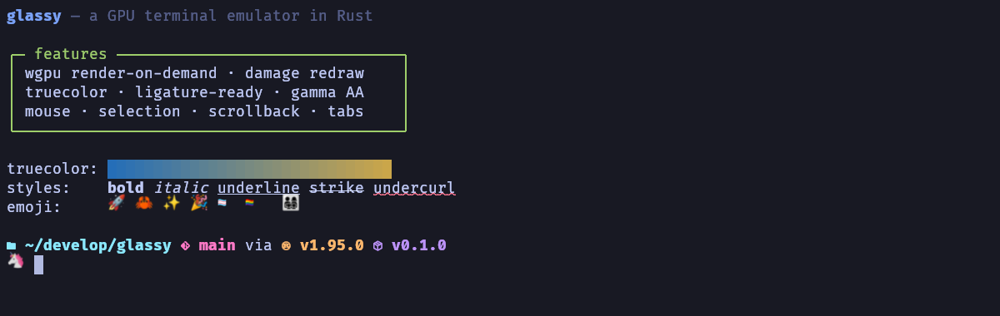
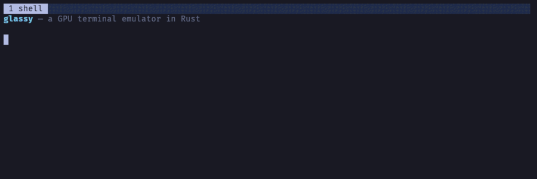
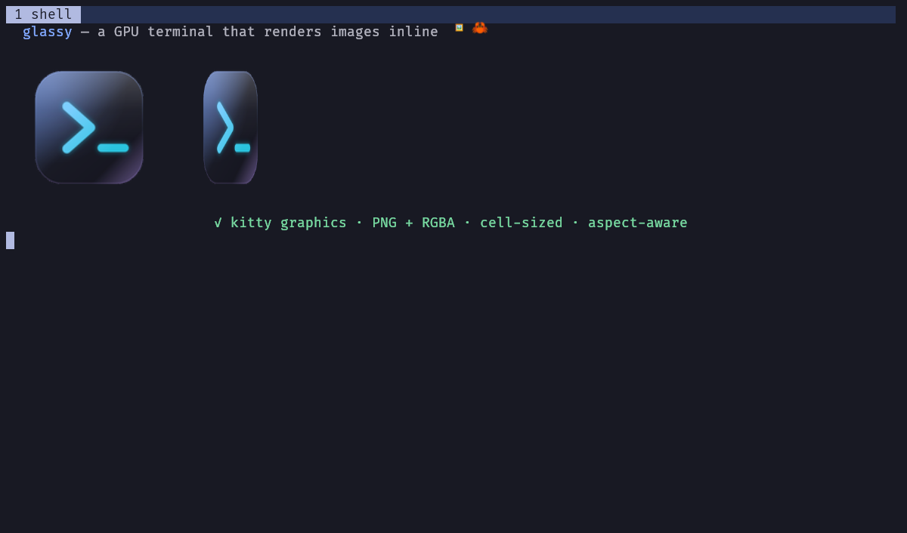
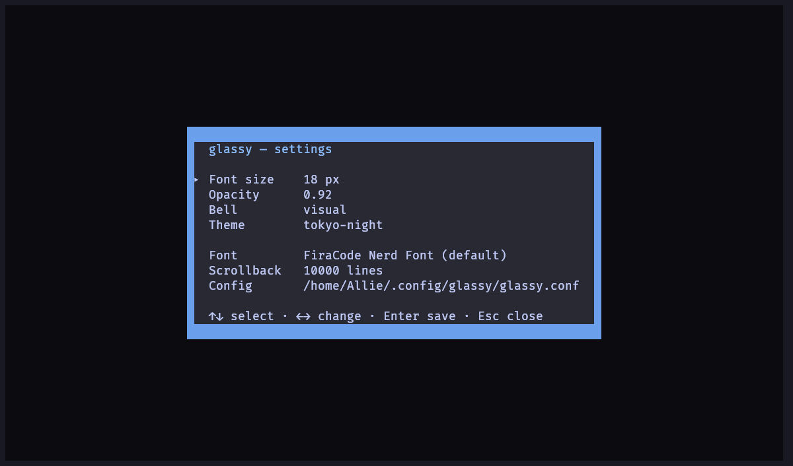

<div align="center">

# glassy

**A minimal, blazing-fast, GPU-accelerated terminal emulator in Rust — built to run Claude Code.**

[](https://github.com/alliecatowo/glassy/actions/workflows/ci.yml)
[](LICENSE)
[](https://www.rust-lang.org)

<br/>



<br/>
<br/>



<br/>
<br/>



<br/>
<br/>



</div>

---

## Why glassy

glassy is small and quiet on purpose. It does the work the GPU is good at, and nothing else.

- **Tiny footprint.** The stripped release binary is **~10 MB** — compare ~123 MB for ghostty. Fat LTO, a single codegen unit, and `panic = "abort"` keep it lean.
- **0% idle CPU.** Rendering is **on-demand**: with nothing changing on screen, glassy issues no frames and burns no cycles. No background spin, no wakeups.
- **Damage-based redraw.** When the screen *does* change, only the cells that actually changed are re-rasterized and re-uploaded — not the whole grid.
- **Low input latency.** The swapchain uses **Mailbox** present mode with **`max_frames_in_flight = 1`**, so a keystroke reaches the glass on the very next frame instead of queueing behind buffered ones.

Accurate, not magic: glassy is fast because it's simple and because it leans on the GPU for the parts that matter.

---

## Features

**Rendering**
- 🎮 GPU **instanced** renderer with a dynamic glyph atlas — one draw, many cells
- 🌈 **Gamma-correct** antialiasing for crisp, correctly-weighted text
- 💤 **Render-on-demand** + **damage-based** redraw (0% idle CPU)
- 🖼️ **Inline images** — kitty graphics (PNG + raw RGBA, cell-sized, aspect-aware) **and sixel**, drawn on a dedicated GPU atlas

**Color & text**
- 🎨 Full **24-bit truecolor** and **256-color** support
- 🔤 **FiraCode Nerd Font** by default, with **full color emoji** — ZWJ sequences, family/profession, skin-tone modifiers, and flags — plus **CJK** fallback
- 📐 **Procedural box-drawing** (light / heavy / double / rounded) and block elements, rendered as crisp geometry
- ✏️ Text decorations: **underline, double, curly, dotted, dashed, strikethrough** — with **SGR 58** colored underlines
- ▌ Cursor **shapes** (block / bar / underline) + **blink**

**Interaction**
- 🖱️ **Mouse reporting** (SGR), hover, **selection**, **clipboard**, and **scrollback**
- 🔗 **OSC 8 hyperlinks** — Ctrl+click to open
- 🗂️ **Tabs** with a slim title/tab bar — scrollback indicator + **activity dots** on busy background tabs
- 🪟 **Translucency** (configurable opacity, adjustable live)

**Comfort**
- 🎛️ **In-app settings** (`Ctrl+,`) — live font size / opacity / bell / theme, saved back to your config
- ❓ **Help overlay** (`F1`) — a built-in keybinding cheat-sheet
- 🎨 **8 built-in themes** — Tokyo Night, Catppuccin Mocha/Macchiato, Gruvbox, Dracula, Nord, Solarized, Rosé Pine — switchable live
- ⚙️ **Runtime config** + live **font resize**
- 🔔 **Bell** — soft visual flash and/or audible beep

---

## Install

### One-liner (Linux / macOS)

Downloads the latest pre-built binary, verifies its SHA-256 checksum, and
installs to `~/.local/bin` (no sudo required):

```sh
curl -fsSL https://raw.githubusercontent.com/alliecatowo/glassy/main/scripts/install.sh | bash
```

Make sure `~/.local/bin` is on your `PATH`. The script prints a reminder if it
isn't. To install system-wide instead: `INSTALL_DIR=/usr/local/bin curl … | bash`
(requires sudo for that dir).

---

### Package managers

**Debian / Ubuntu — apt / .deb**

```sh
# Download the latest .deb from the GitHub Releases page, then:
sudo dpkg -i glassy_*_amd64.deb
sudo apt-get install -f   # fix any missing dependencies
```

**Fedora / RHEL / openSUSE — dnf / .rpm**

```sh
# Download the latest .rpm from the GitHub Releases page, then:
sudo dnf install glassy-*.rpm
# or: sudo rpm -i glassy-*.rpm
```

**Arch Linux — AUR**

```sh
# Build from source (compile time ~5 min):
yay -S glassy
# or with paru:
paru -S glassy

# Pre-built binary (faster install; no Rust toolchain needed):
yay -S glassy-bin
```

**macOS — Homebrew** _(tap not yet published; use the one-liner above for now)_

```sh
# Once the tap is live:
brew tap alliecatowo/glassy
brew install glassy
```

**Flatpak** _(not yet on Flathub; local build from the manifest)_

```sh
flatpak-builder build packaging/flatpak/io.github.alliecatowo.glassy.yaml --install
```

**cargo install** (always builds the latest main — slower but cross-platform):

```sh
cargo install --git https://github.com/alliecatowo/glassy --locked
```

---

### Build from source

```sh
git clone https://github.com/alliecatowo/glassy
cd glassy
make build install   # installs to ~/.local/bin (no sudo)
```

`make install` also installs the bundled color-emoji font to
`~/.local/share/glassy/fonts/NotoColorEmoji.ttf`. To install system-wide:
`sudo make build install PREFIX=/usr`

For just the binary: `cargo build --release` → `target/release/glassy`

For the audible bell (needs audio dev libs — `alsa-lib-devel` / `libasound2-dev`):

```sh
cargo build --release --features bell-audio
```

---

## Configuration

glassy reads `$XDG_CONFIG_HOME/glassy/glassy.conf` (falling back to `~/.config/glassy/glassy.conf`). It's a simple `KEY=VALUE` file; `#` and `;` start comments. Every key is optional — defaults shown:

```ini
# ~/.config/glassy/glassy.conf

font_family  = FiraCode Nerd Font Mono   # family name, or a path to a font file
font_size    = 14                        # points
opacity      = 0.92                       # 0.0 (clear) .. 1.0 (opaque)
padding      = 6                          # grid inset, logical px
scrollback   = 10000                      # lines of history
theme        = tokyo-night                # tokyo-night, catppuccin-mocha, catppuccin-macchiato,
                                          #   gruvbox-dark, dracula, nord, solarized-dark, rose-pine
bell_visual  = true                       # flash the window on bell
bell_audible = false                      # soft beep on bell (needs bell-audio build)
shell        = /usr/bin/zsh -l            # program + args (defaults to your login shell)
```

**CLI flags** override the file:

```sh
glassy --font-size 16 --opacity 0.85           # override look at launch
glassy --theme catppuccin-mocha                # pick a theme
glassy -e htop                                  # run a command instead of the shell
```

Other flags: `--font-family`, `--padding`, `--scrollback`, `--bell-visual`, `--bell-audible`, `--help`, `--version`.

---

## Keybindings

| Action | Binding |
| --- | --- |
| Help overlay | `F1` |
| Settings | `Ctrl+,` |
| Copy | `Ctrl+Shift+C` |
| Paste | `Ctrl+Shift+V` |
| New tab | `Ctrl+Shift+T` |
| Close tab | `Ctrl+Shift+W` |
| Next tab | `Ctrl+Tab` |
| Previous tab | `Ctrl+Shift+Tab` |
| Increase font size | `Ctrl++` |
| Decrease font size | `Ctrl+-` |
| Reset font size | `Ctrl+0` |
| Scroll up / down | `Shift+PageUp` / `Shift+PageDown` |
| Scroll to top / bottom | `Shift+Home` / `Shift+End` |
| Open hyperlink | `Ctrl`+Left-click |

> Inside **Settings** (`Ctrl+,`): `↑`/`↓` select, `←`/`→` change, `Enter` saves to your config, `Esc` closes.

---

## Benchmarks

Rough, honest numbers (binary size, idle RSS, idle CPU, startup) and how they were measured live in [docs/benchmarks.md](docs/benchmarks.md).

---

## Architecture

glassy is deliberately a thin stack:

- **Rendering:** [`wgpu`](https://github.com/gfx-rs/wgpu) **29** drives the GPU. Text shaping and rasterization go through [`cosmic-text`](https://github.com/pop-os/cosmic-text) + [`swash`](https://github.com/dfrg/swash), feeding a dynamic glyph atlas consumed by an instanced draw.
- **Windowing & input:** [`winit`](https://github.com/rust-windowing/winit) **0.30**.
- **PTY / VT parsing:** [`alacritty_terminal`](https://github.com/alacritty/alacritty) handles the pseudo-terminal and the terminal state machine **today** — and is being **incrementally replaced** with hand-rolled, more-performant pieces. The PTY and color boundaries are kept swappable so chunks can be swapped out without a rewrite.

The honest version: parts of glassy stand on mature crates while the bespoke, faster replacements land one at a time.

---

## Status / roadmap

**Working today:** GPU rendering, truecolor + 256, color emoji + CJK fallback, box-drawing, text decorations, cursor shapes/blink, mouse + selection + clipboard, scrollback, OSC 8 hyperlinks, tabs with activity indicators, translucency, **8 live-switchable themes**, **in-app settings (`Ctrl+,`)** + **help overlay (`F1`)**, runtime config, bell, **inline images (kitty graphics + sixel)**.

**Planned:**
- ⬛ Window splits / panes
- ⌨️ Kitty keyboard protocol
- 🔔 OSC 9 / OSC 777 desktop notifications

---

## License

MIT — see [LICENSE](LICENSE). © Allie.
